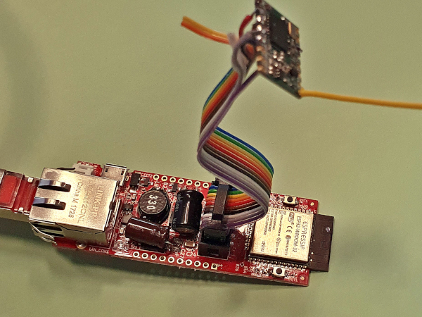

# LoRa 2 MQTT Gateway

## All infos on: <https://www.weigu.lu/microcontroller/lora2mqtt_SX_eth_gateway/index.html>

## Some infos

For a school project (Nursing) we needed a LoRa to MQTT gateway. For hardware we used an Ethernet POE Board from Olimex with a LoRa 1276 breakout board.
The gateway can receive AES128-GCM encryted LoRa messages and pass them to a secure mqtt server working with  pre shared keys.
